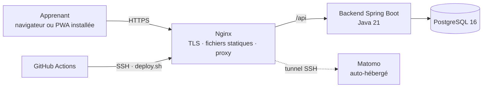

# French Voyage Akademie

Plateforme web **gratuite** d'apprentissage du français, conçue pour les personnes migrantes, les
personnes qui préparent un départ vers un pays francophone et toute personne qui a besoin du
français pour vivre, étudier ou travailler — sans pouvoir payer une école de langues.

Projet de Service Social — Licenciatura en Ingeniería en Software, Universidad Da Vinci.
Auteur : Raul Antonio Gamero Navarrete · Licence : [MIT](LICENSE)

---

## Ce que contient ce dépôt

| Élément | État |
|---|---|
| Niveau A1 complet : 3 unités, **30 leçons**, 90 sections, 240 entrées de vocabulaire, 150 exercices | ✅ rédigé, chargé et vérifié en base |
| API REST Spring Boot : inscription, authentification JWT, catalogue, progression, évaluation, RGPD | ✅ 43 tests, couverture de lignes 59,9 % |
| Application web progressive Ionic + Angular, interface anglais / français | ✅ build de production, tests unitaires |
| Schéma PostgreSQL versionné par Flyway, extensible de A1 à C2 sans migration de structure | ✅ appliqué sur PostgreSQL 16 |
| Conteneurs, Nginx + TLS, sauvegardes, Matomo, CI/CD GitHub Actions | ✅ écrit et validé syntaxiquement — à exécuter sur le VPS |
| Documentation technique (architecture, UML, API, déploiement, qualité) | ✅ [`docs/`](docs/) |

## Architecture en une image



Détails : [docs/01-architecture.md](docs/01-architecture.md).

## Démarrage local

Prérequis : Docker, Node.js 22, et pour travailler sur le backend hors conteneur un JDK 21 et Maven.

```bash
cp .env.example .env
```

Renseignez au minimum `FVA_JWT_SECRET` (32 caractères ou plus), puis :

```bash
docker compose up -d --build
```

- API : http://localhost:8080
- Documentation interactive : http://localhost:8080/swagger-ui.html

Le frontend se lance à part, avec rechargement à chaud :

```bash
cd frontend && npm install && npm start
```

Application : http://localhost:8100

Au premier démarrage, Flyway crée le schéma et charge les 30 leçons (environ 15 secondes).

## Commandes utiles

| Objectif | Commande |
|---|---|
| Tests backend + contrôle de couverture ≥ 40 % | `cd backend && mvn verify` |
| Tests frontend | `cd frontend && npm test` |
| Build de production du frontend | `cd frontend && npm run build:prod` |
| Régénérer les migrations après modification du contenu | `python tools/generate_seed.py` |
| Vérifier que le SQL commité correspond au contenu | `python tools/generate_seed.py --check` |

## Modifier le contenu pédagogique

Les leçons sont rédigées en JSON dans [`content/a1/`](content/a1/) — aucun SQL à écrire. Le script
[`tools/generate_seed.py`](tools/generate_seed.py) valide la cohérence pédagogique (une seule bonne
réponse par QCM, traductions présentes, réponses attendues pour les textes à trous) puis produit les
migrations Flyway. Procédure complète : [docs/06-contenu-pedagogique.md](docs/06-contenu-pedagogique.md).

## Structure

```
backend/            API Spring Boot (catalogue, progression, utilisateurs, sécurité)
  src/main/resources/db/migration/   V1 schéma · V2 niveaux · V3–V5 unités A1 (générées)
  src/main/resources/legal/          politique de confidentialité et mentions légales EN/FR
frontend/           PWA Ionic + Angular + Tailwind + ngx-translate
  nginx/            configuration de production (TLS, en-têtes de sécurité, proxy)
content/a1/         contenu des 30 leçons, source de vérité éditoriale
tools/              génération et validation des migrations de contenu
infra/scripts/      sauvegarde, restauration, certificat, déploiement
docs/               architecture, modèle de données, UML, API, déploiement, qualité, ADR
.github/workflows/  intégration et déploiement continus
```

## Principes non négociables

- **Gratuité totale.** Aucune fonctionnalité pédagogique payante, aucune publicité.
- **Minimisation des données.** Ni nationalité, ni pays, ni statut administratif ne sont demandés.
- **Aucun traceur tiers.** Mesure d'audience par Matomo, sur le même serveur.
- **Aucune certification revendiquée.** Le CECR sert de référence indicative ; seuls les organismes
  habilités délivrent le DELF.
