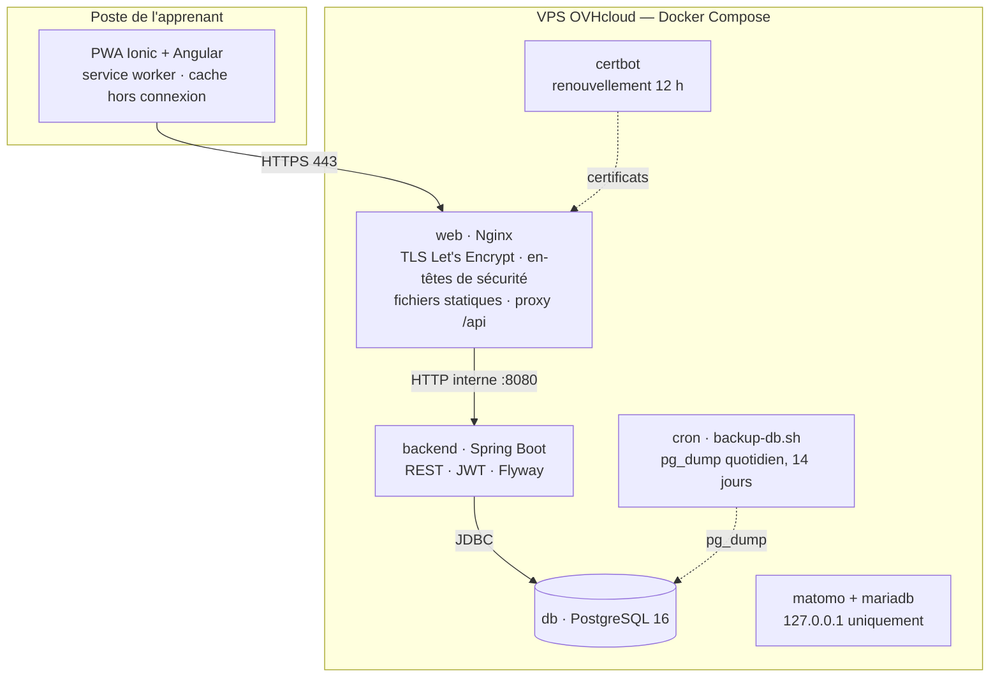
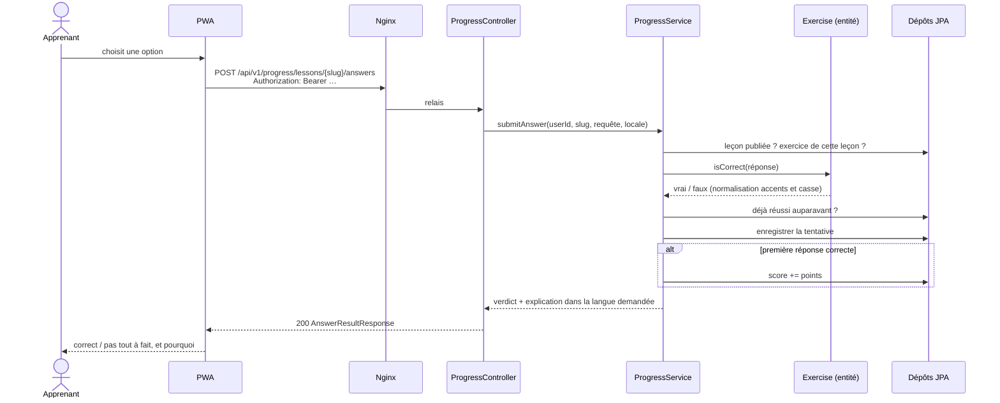

# 1. Architecture du système

## 1.1 Vue d'ensemble

French Voyage Akademie est une application trois tiers classique, volontairement sobre : une seule
personne la développe et l'exploite, sur un serveur privé virtuel à 13,10 € par mois.



Seuls les ports 80 et 443 sont exposés. La base, l'API et Matomo ne sont accessibles que depuis le
réseau interne des conteneurs ; Matomo se consulte par tunnel SSH.

## 1.2 Backend — organisation par domaine

Le code est découpé par **domaine métier**, et non par couche technique : tout ce qui concerne la
progression vit dans `progress/`, du contrôleur à l'entité. Un nouveau module (A2, forum, tutorat)
s'ajoute sans toucher aux autres.

```
com.frenchvoyage.akademie
├── auth/        inscription, connexion
├── user/        compte, profil, droits RGPD
├── catalog/     niveaux, unités, leçons, sections, vocabulaire, exercices
├── progress/    progression, tentatives, notation
├── legal/       textes légaux versionnés
├── security/    JWT, filtre d'authentification
├── config/      Spring Security, OpenAPI, propriétés
├── common/      erreurs, langues, normalisation de texte
└── bootstrap/   compte d'administration de développement
```

À l'intérieur de chaque domaine, les couches restent classiques :
**contrôleur → service → dépôt → entité**, avec des DTO (`record` Java) aux frontières. Aucune entité
JPA ne sort jamais d'un service : la correction des exercices, en particulier, ne peut pas fuiter
vers le client par sérialisation accidentelle.

## 1.3 Frontend

| Dossier | Rôle |
|---|---|
| `core/` | services transverses : API, session, langue, intercepteur HTTP, garde de route |
| `shared/` | composants et pipes réutilisables — rendu Markdown sécurisé, sélecteur de langue |
| `pages/` | une page par route, chargée à la demande |

Choix structurants :

- **Composants autonomes Angular 18 et signaux** : pas de NgModule, état local lisible.
- **Chargement paresseux de chaque page**, puis préchargement en arrière-plan : le premier affichage
  pèse environ 265 Ko transférés, et l'application entière reste disponible si la connexion tombe.
- **Service worker** : catalogue en stratégie *performance* (cache d'abord, 7 jours), progression en
  stratégie *freshness* (réseau d'abord, cache en secours).

## 1.4 Flux principal : répondre à un exercice



L'identifiant de l'utilisateur provient **exclusivement du jeton** ; aucune route ne l'accepte en
paramètre. Lire ou modifier la progression d'autrui est donc impossible par construction.

## 1.5 Décisions d'architecture

Chaque décision non triviale est consignée dans [`docs/adr/`](adr/) :

| ADR | Décision |
|---|---|
| [0001](adr/0001-traductions-par-table.md) | Textes traduits dans des tables `*_translations` indexées par langue |
| [0002](adr/0002-contenu-json-genere-en-sql.md) | Contenu rédigé en JSON, converti en migrations Flyway versionnées |
| [0003](adr/0003-jwt-sans-etat.md) | Authentification JWT sans état, jeton unique à durée limitée |
| [0004](adr/0004-catalogue-public.md) | Catalogue consultable sans compte |
| [0005](adr/0005-markdown-maison.md) | Rendu Markdown écrit sur mesure plutôt qu'une bibliothèque |
