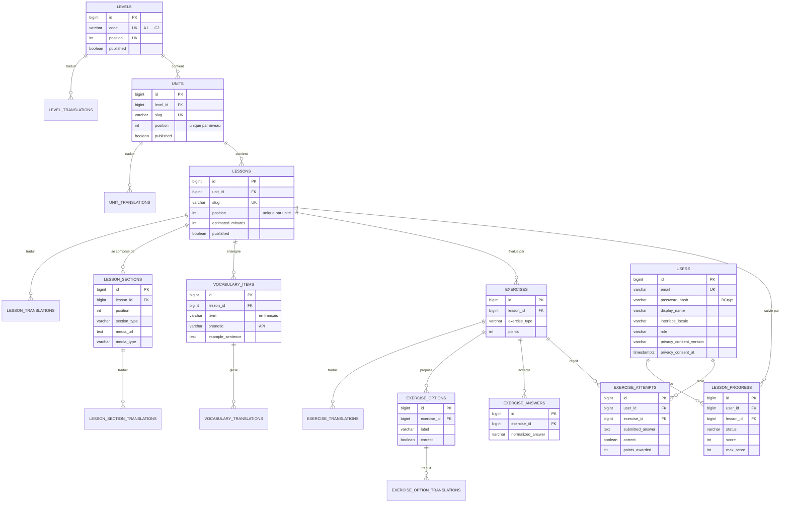

# 2. Modèle de données

Schéma PostgreSQL géré exclusivement par Flyway
([`V1__baseline_schema.sql`](../backend/src/main/resources/db/migration/V1__baseline_schema.sql)).
Hibernate fonctionne en mode `validate` : il vérifie au démarrage que les entités correspondent au
schéma, sans jamais le modifier.

## 2.1 Diagramme entité-relation

Toutes les tables `*_TRANSLATIONS` ont la même forme : clé primaire composite
`(id_parent, locale)` et les colonnes textuelles de l'entité parente.

## 2.2 Choix de conception

**Extensibilité de A1 à C2 sans changement de structure.** Les six niveaux existent dès la migration
V2 ; seul A1 est publié. Ouvrir A2 revient à ajouter un fichier `content/a2/unit-1.json` et à passer
`published` à vrai. C'est la réponse directe à l'objectif spécifique n° 9 du projet.

**Langues d'interface sans changement de structure.** Voir l'[ADR 0001](adr/0001-traductions-par-table.md).
Ajouter l'espagnol consiste à insérer des lignes `locale = 'es'` et à ajouter `es` dans
`LocaleSupport.SUPPORTED` ; en l'absence de traduction, l'API se rabat sur l'anglais, de sorte qu'une
traduction partielle ne casse jamais l'affichage.

**Contraintes d'intégrité au plus près des données.** Unicité des positions par parent, énumérations
contrôlées par `CHECK`, bornes sur les points et les durées, suppression en cascade. Une erreur de
contenu est refusée par la base elle-même, pas seulement par le code.

**Suppression en cascade depuis `users`.** Supprimer un compte efface sa progression et ses tentatives
dans la même transaction : c'est la mise en œuvre technique du droit à l'effacement.

**Réponses libres normalisées.** Les réponses attendues des textes à trous sont comparées après
suppression des accents, de la casse et de la ponctuation. Au niveau A1, taper « ecole » sur un
clavier de téléphone sans accents n'est pas une erreur de compréhension.

## 2.3 Volumétrie du niveau A1

Mesurée après application des migrations sur PostgreSQL 16 :

| Table | Lignes |
|---|---|
| `levels` | 6 |
| `units` (publiées) | 3 |
| `lessons` (publiées) | 30 |
| `lesson_sections` | 90 |
| `vocabulary_items` | 240 |
| `exercises` | 150 |
| `exercise_options` | 354 |
| `exercise_answers` | 57 |

Contrôles d'intégrité exécutés sur la base chargée, tous à zéro anomalie : QCM sans exactement une
bonne réponse, texte à trous sans réponse attendue, leçon sans traduction anglaise ou française,
vocabulaire sans glose anglaise.
