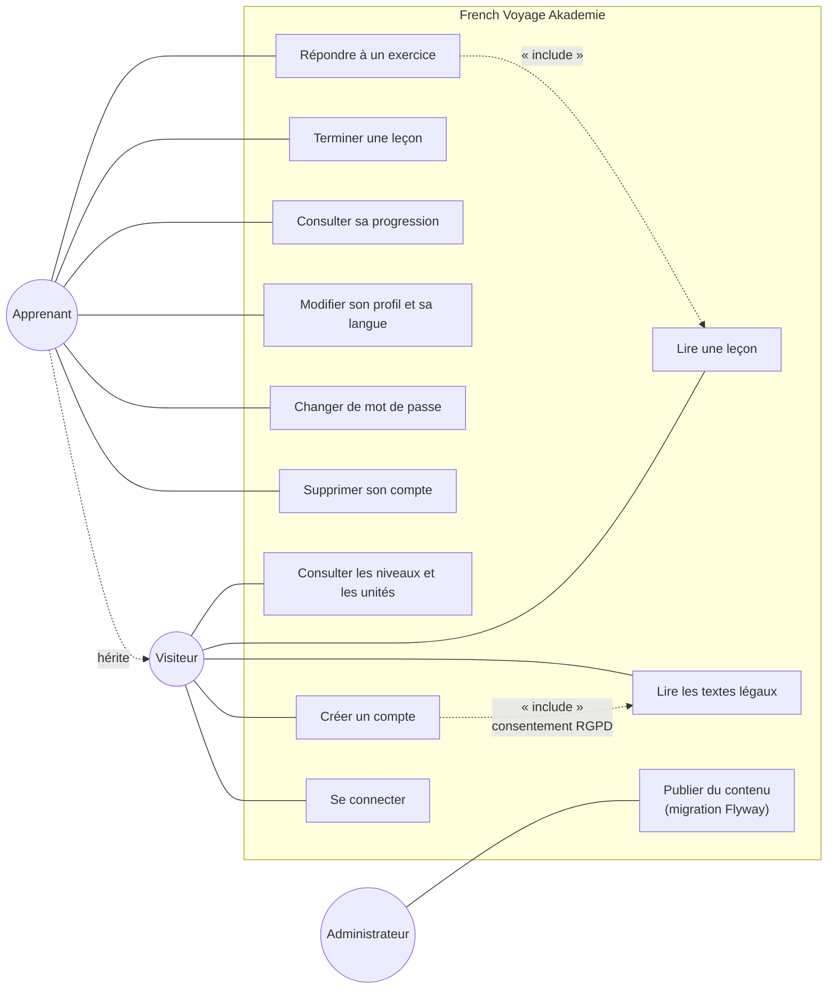
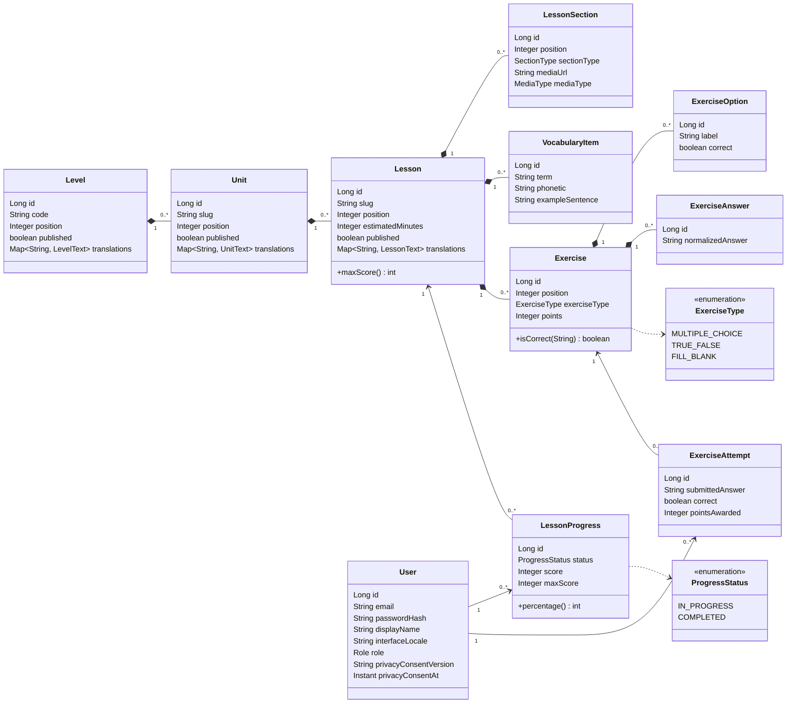
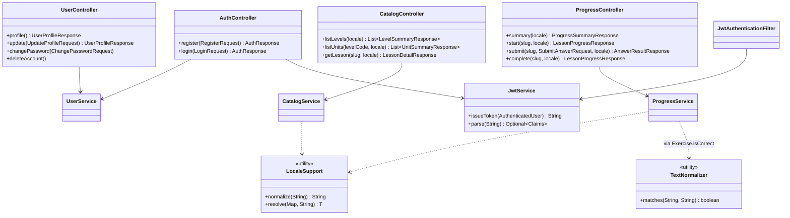
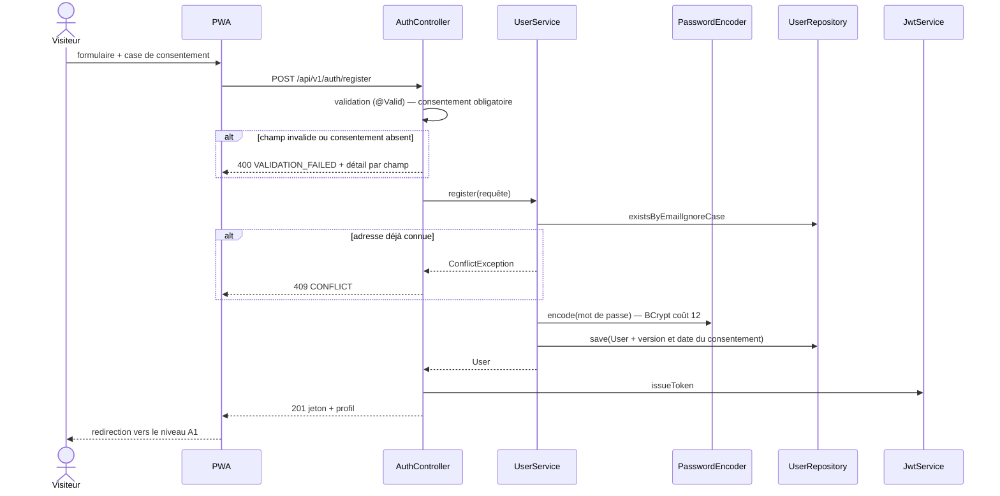
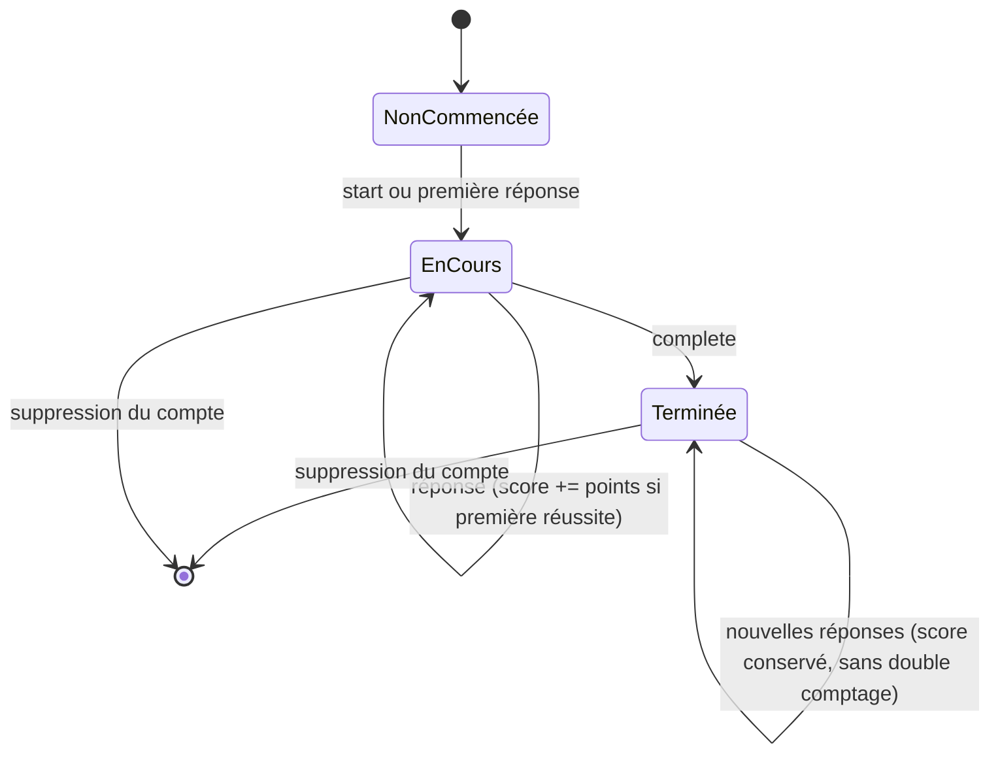

# 3. Modélisation UML

## 3.1 Cas d'utilisation

L'administrateur ne dispose volontairement d'aucune interface de saisie dans cette version : le
contenu est versionné dans le dépôt et publié par migration. Cela garantit la traçabilité de chaque
modification pédagogique et évite une surface d'attaque supplémentaire.

## 3.2 Diagramme de classes — domaine

## 3.3 Diagramme de classes — services et contrôleurs

## 3.4 Séquence — inscription

## 3.5 États d'une progression

`NonCommencée` n'est pas stocké : c'est l'absence de ligne dans `lesson_progress`.
